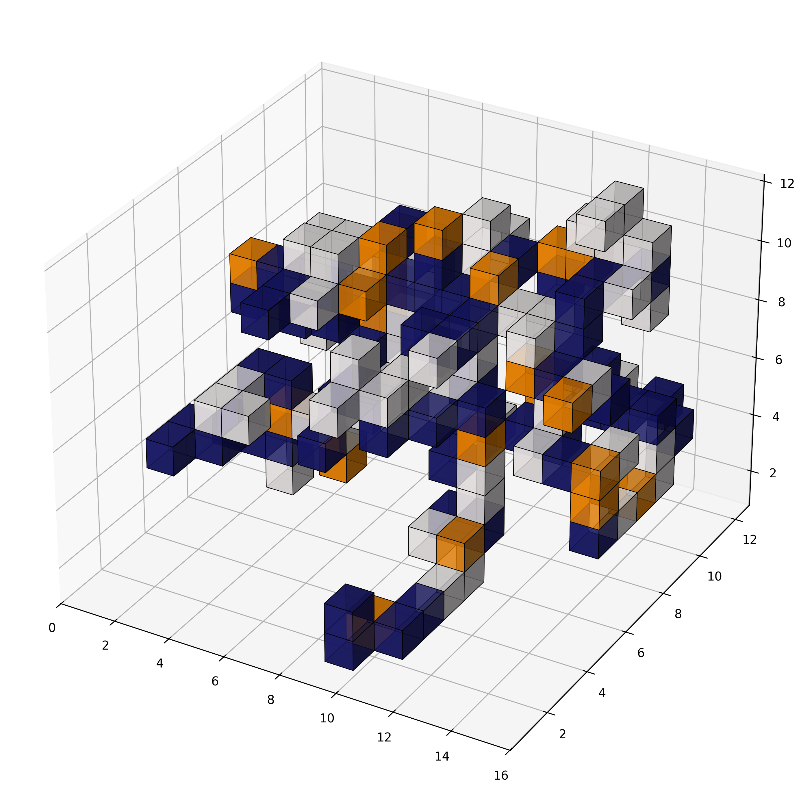
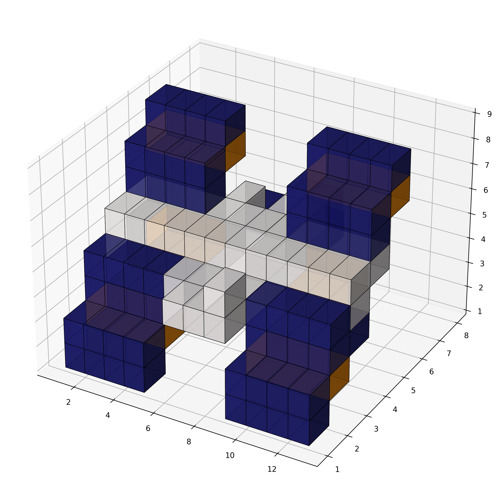
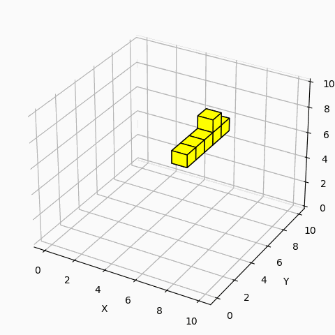
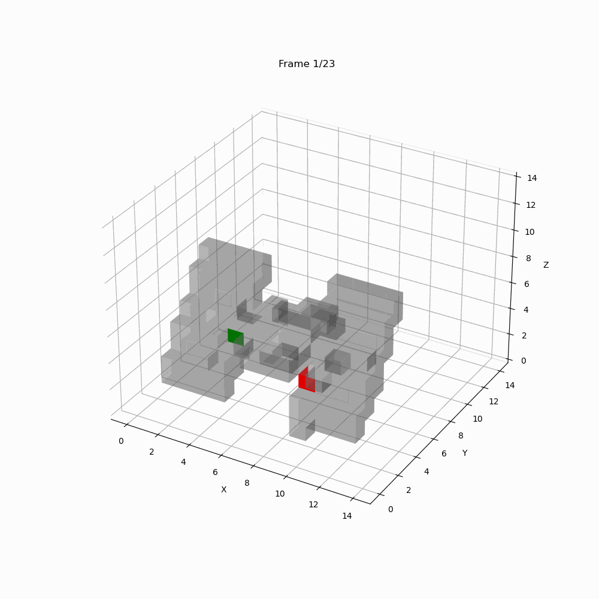

# Bachelor Thesis Programmable Cubes
This project implements the rule-based reconfiguration algorithms proposed in the thesis.

## Pivoting Cube Model with Multiple Module Types
This project introduces two algorithms for self-reconfigurable cube-shaped robots consisting of multiple module types. The goal is to reconfigure the initial shape of the robot $C_i$ into a target shape $C_t$. The movement logic was provided by the ESA optimization team. For more details, see the [SPOC-3 Programmable Cubes Challenge](https://optimise.esa.int/challenge/spoc-3-programmable-cubes/About).

### Example Instance - ISS

| $C_i$ (Initial) | $C_t$ (Target) |
|:--------------:|:--------------:|
|  |  |

This instance has been solved using the designed algorithms:  

## In-Place Algorithm (IPA)

**Features:**
- Direct Reconfiguration Algorithm
- Can generate much shorter reconfiguration sequences
- Optimized for efficiency, but is not always able to reconfigure completely

**Visualization:**  


## Common Shape Algorithm (CSA)

**Features:**
- Intermediate Configuration Approach
- More robust, by an intermediate configuration
- Requires more reconfiguration steps

**Visualization:**  


## How to Run 
The code runs on Python 3.9. To use the proposed algorithms, install the following Python modules: 
````
numba
numpy
matplotlib
````
To test if everything works correctly:

Linux and Mac: 
````
python3 Main.py
````
Windows: 
````
python Main.py
````
This test runs both algorithms to solve the ISS instance of the Programmable Cubes Challenge and generates to GIFs to visualize the reconfiguration process. A simple overview of the algorithms is provided below. 

## Class overview
The main components are: 
- IPASolver → In-Place Algorithm
- CSASolver → Common Shape Algorithm 
- Generator → Creates Problem Instances (Initial Configuration, Target Configuration, Initial Types and Target Types)
- Programmable Cubes Framework → Challenge Instances and Pivoting Cube Model logic 
- Animation → Creates GIFs of the reconfiguration process 

## Robot Reconfiguration
The robot reconfigures itself by pivoting its modules, there are 6 diffrent possible pivoting commands: 

- `0` and `1`: counter-clockwise and clockwise rotation in x-y plane (around z-axis).
- `2` and `3`: counter-clockwise and clockwise rotation in y-z plane (around x-axis).
- `4` and `5`: counter-clockwise and clockwise rotation in x-z plane (around y-axis).

| Move 0 | Move 1 |
|--------|--------|
|  |  |
| Move 2 | Move 3 |
|  |  |
| Move 4 | Move 5 |
|  |  |

### Module Move Algorithms
This project implements a variety of algorithms to move a module to a specified target position. In the `move_algorithms` folder, you'll find the following classes:

- **ManipulateMove**: Frees a module or target position by relocating any blocking, surrounding modules, then moves the module to the target position using one of the two mover classes. 
- **Mover**: Uses a BFS approach to find a path for the module to the specified target position. 
- **MoverAStar**: An A* variant of the mover algorithm that attempts to find a more optimal path.

To help debug these algorithms, you can visualize the movement sequences using ```debug/ipaDebug/visualizeMoves()```, which creates animations like the one below:  

